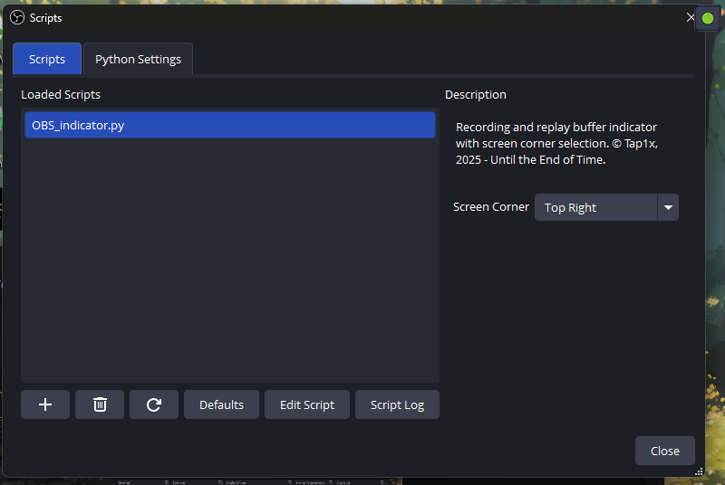

Description

A super-lightweight Python/Tkinter overlay that shows recording and Instant-Replay status icons (in the style of NVIDIA Geforce Instant Replay) on top of all windows (except exclusive fullscreen), with no external dependencies, and fully visible in your OBS captures.

Functionality

• Green “REC” icon on a dark background during recording

• Red circular icon with white replay arrows displayed for 5 seconds when the replay buffer is saved

Donations

If you’d like to support development, you can donate to my Russian bank card:

2200 7009 5711 8671 (T-Bank)

https://youtu.be/9vLdm1SSIww

